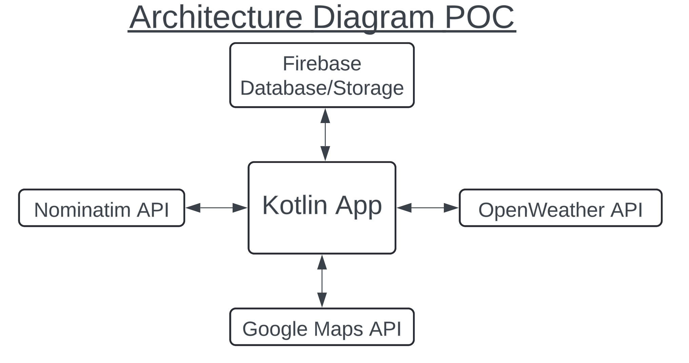
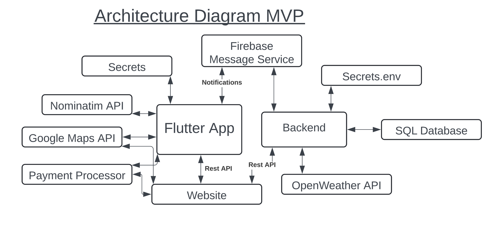

# Functional Requirements

# Party Planning App - Key Features of the MVP

## Key Features for Users

Our app offers a variety of features designed to enhance the party planning experience for both event organizers and attendees. Here are the key features available to users:

### Event Organizer Features
- **Create Events**: Organizers can create events with detailed information including title, description, location, and dates.
- **Manage Events**: Organizers can view and manage the events they have created, with the ability to edit event details as needed.
- **Event Logistics**: Add supplies, parking, and accommodations (e.g., beds) to events. Distribute the supplies among attendees.

### Event Goer Features
- **Find Events**: Users can search for and locate events that match their interests and join them.
- **Manage Participation**: Attendees can view and manage the events they have joined, with rights to interact based on their role.
- **Event Discovery**: Events can be searched by tags, location radius, or a specific location.

## Comprehensive Feature List

Our app provides a rich set of features to cater to the needs of both guests and registered users:

### General Features
- **Guest Access**: Guests can browse available events without creating an account. Account creation is only required to join an event.
- **Multilingual Support**: Supports English and French, automatically adjusting based on the Android device's language settings.
- **Google Account Login**: Quick and secure login via Firebase using existing Google accounts.
- **Persistent Login**: The app remembers your login, so you are automatically taken to the home screen upon relaunch.
- **Location-Based Event Feed**: Events are dynamically displayed on the home screen based on the user's current GPS location.

### User Account/Event Features
- **Profile Management**: Users can create and edit profiles, including first name, last name, and profile picture.
- **Event Details**: Events include titles, descriptions, locations, and dates/times.
- **Event Tagging**: Events can be tagged for easy searching on the discover events page.
- **Privacy Options**: Events can be kept private or made public.

### Event Interaction Features
- **Supplies Management**: Organizers can list required supplies for an event and assign them to attendees.
- **Logistics Information**: Add parking details, accommodations, and images to event listings.
- **Social Integration**: Link social media group chats and Spotify playlists for seamless communication and music sharing.
- **Event Search**: Search for events based on current location or specified future locations.
- **Event Sharing**: Share event links or QR codes for easy access by others.
- **Calendar Integration**: Add events directly to your calendar to avoid forgetting them.
- **Polls and Voting**: Create polls for event attendees to vote on various aspects of the event.
- **Role-Based Access**: Different roles (owner, staff, guests) with distinct capabilities and screens to manage events effectively.
- **Weather Forecast**: For the dates of the event, a weather forecast is available and displayed on the EventScreen.

### Architecture Diagrams

## Key Internal Functionality

### Authentication and User Management
- **Authentication**: The app provides authentication via the login screen, allowing users to access the app either as guests (unauthenticated) or through Google accounts using Firebase Authentication. Authenticated Google accounts are linked to unique ChampagneAccounts.
- **ChampagneAccounts Privilege Levels**: ChampagneAccounts have three privilege levels within events:
  - **Owner (Creator)**: Full control over event management.
  - **Staff**: Ability to create polls, assign supplies.
  - **Guest**: View-only access to event information.

### Data Storage and Management
  - **SQL Database**: Stores all data related to user accounts and events.
  - **Firebase Storage**: Manages and stores account and event images.

### External API Integration
- **Nominatim API**: Fetches location data to provide accurate event locations.
- **OpenWeather API**: Retrieves weather information relevant to event locations, enhancing user planning and experience.

### Deep Linking and QR Code Functionality
- **Deep Links**: Integrated into the app's navigation graph, allowing links to open the app directly to the specified event. Users can share and access events through deep links.
- **QR Codes**: Generate and scan QR codes within the app to quickly access specific events.

### Location and Event Discovery
- **GPS Integration**: Uses the device’s GPS sensor to generate a personalized event feed based on the user's current location, making it easy to discover nearby events.
- **Calendar Integration**: Allows users to open events in their calendar app and save event details, ensuring they don’t miss out on any planned activities.

### Social Media and External App Integration
- **Social Media Links**: Enables opening of social media apps directly from the app for group chats and music sharing, providing a seamless user experience across platforms.
